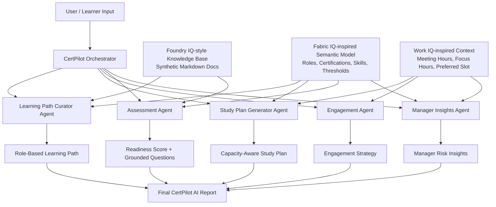

# Architecture Diagram

Use this Mermaid diagram in your README or convert it to an image for the submission.

## Explanation

- The orchestrator coordinates specialized agents.
- The Foundry IQ-style knowledge layer grounds learning-path and assessment outputs.
- The Work IQ-inspired context layer adapts study scheduling to synthetic work signals.
- The Fabric IQ-inspired semantic layer represents business meaning: role, certification, skills, readiness score, thresholds, and study recommendations.
- All data is synthetic and safe for public demo use.
